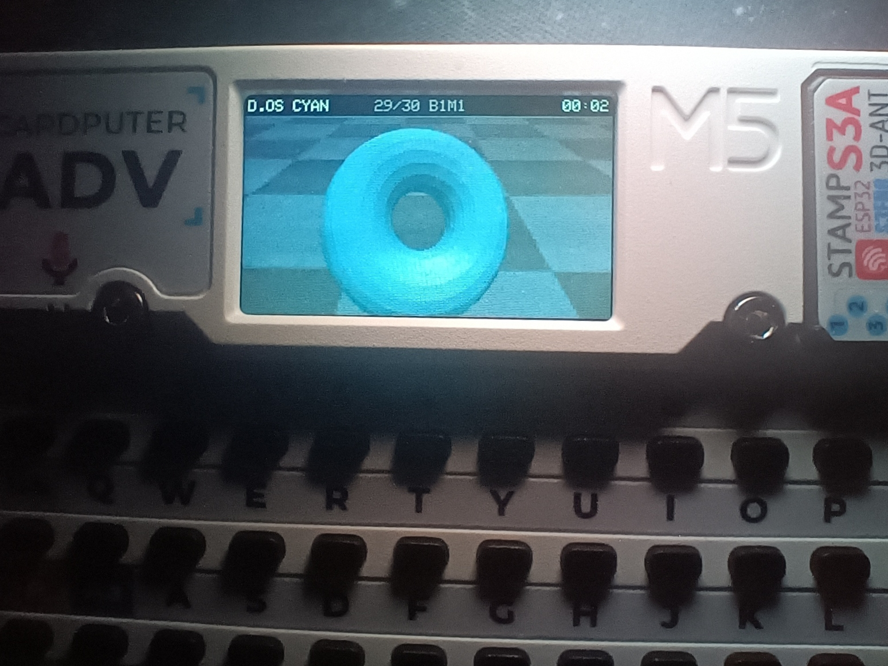

# DONUT.OS

> **D.OS** — A polished OS-like visual firmware for M5Stack Cardputer, featuring a real-time 3D donut renderer, a1k0n-style perspective checker background, RGB+ palette mode, system panels, stopwatch/timer, AutoDim, and GO-button DeepSleep.

---

**DONUT.OS / D.OS** is an OS-like visual firmware for M5Stack Cardputer and Cardputer-ADV. It is not a traditional operating system kernel — it is a polished, compact, interactive firmware shell: real-time 3D donut software rendering, a1k0n-style perspective checker background, RGB+ palette mode, system panels, stopwatch/timer, AutoDim, and GO-button DeepSleep.

## Photo

## Features

### Rendering

- Real-time 3D donut software renderer
- Solid torus mesh with z-buffer visibility
- Shade buffer for lighting
- Optional glow effect
- Dirty rect composition for efficient updates
- No dynamic allocation in render hot path

### Background

- a1k0n-style perspective checker background
- Top-small / bottom-large perspective grid
- Moving checker floor
- Half-resolution background cache for performance
- FLOW and CHECK+FLOW background modes

### RGB+ Palette Mode

- Palette-level RGB+ effect
- Inspired by RGB565 byte-swap aesthetics
- Does not use actual framebuffer byte swap
- Does not pollute UI colors
- No RGB+ rail/sweep line layer

### UI

- TopBar with system information
- Toast notifications
- Help panel (press `K`)
- System panels: SYS / RND / SET
- Stopwatch and Timer
- Factory Reset chord
- Persistent settings via Preferences V9

### Power & QoL (QoL Version)

- AutoDim after idle
- AutoSleep after long idle
- GO / G0 button DeepSleep
- GO / G0 wake from DeepSleep
- Stopwatch / Timer guard prevents AutoSleep from interrupting active watch usage

## Hardware

**Target hardware:**

- M5Stack Cardputer
- M5Stack Cardputer-ADV

**Display:** 240 × 135 pixels

**Framework & Libraries:**

- Arduino
- ESP32-S3
- M5Cardputer
- M5GFX
- LovyanGFX

> [!NOTE]
> This firmware is designed specifically for M5Stack Cardputer hardware. It is not intended for generic ESP32 boards.

## Build

See [docs/BUILD.md](docs/BUILD.md) for detailed instructions.

**Quick start:**

1. Install [Arduino IDE](https://www.arduino.cc/en/software).
2. Install ESP32 / M5Stack board support.
3. Install `M5Cardputer` and `M5GFX` libraries.
4. Open one of the `.ino` files from `firmware/`.
5. Select the appropriate Cardputer board.
6. Compile and upload.

> The exact board name may vary depending on your M5Stack board package version.

## Controls

| Key | Action |
|-----|--------|
| `Space` | Theme |
| `B` | Background mode |
| `C` | RGB+ toggle |
| `T` | Floating text |
| `K` | Help panel |
| `G` | Glow toggle |
| `H` | Quality toggle |
| `P` | Pause |
| `F` | FPS target |
| `;` / `.` | Speed down / up |
| `+` / `-` | Scale up / down |
| `[` / `]` | Brightness down / up |
| `W` `A` `S` `D` | View pan |
| `0` | View reset |
| `Q` / `E` | Background depth |
| `M` | Motion profile |
| `O` | Idle orbit |
| `Y` | System panel |
| `N` | Stopwatch / Timer |
| `X` | Run / pause watch |
| `Z` | Reset watch |
| `R` + `~` | Factory reset |
| `~` | Restart / boot |
| `GO` / `G0` | DeepSleep (QoL version only) |

See [docs/CONTROLS.md](docs/CONTROLS.md) for full details.

## Versions

| Version | Description |
|---------|-------------|
| `mainline` | Mainline frozen release. Most stable, no QoL features. |
| `qol` | QoL release with AutoDim and GO-button DeepSleep. **Recommended.** |

## Design Notes

See [docs/DESIGN.md](docs/DESIGN.md) for architecture and design decisions.

## References

See [docs/REFERENCES.md](docs/REFERENCES.md) for full credits and references.

**Key inspirations:**

- [a1k0n donut math](https://www.a1k0n.net/2011/07/20/donut-math.html)
- [a1k0n obfuscated donut](https://www.a1k0n.net/2006/09/15/obfuscated-c-donut.html)
- [a1k0n no-math donut](https://www.a1k0n.net/2021/01/13/optimizing-donut.html)
- [TheDonutProject](https://github.com/EvanZhouDev/TheDonutProject)

## License

This project is licensed under the MIT License — see [LICENSE](LICENSE) for details.

## Contributing

See [CONTRIBUTING.md](CONTRIBUTING.md) for guidelines.
